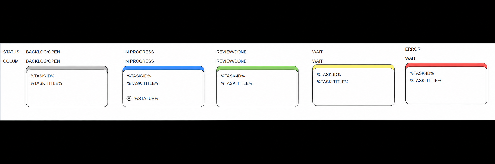
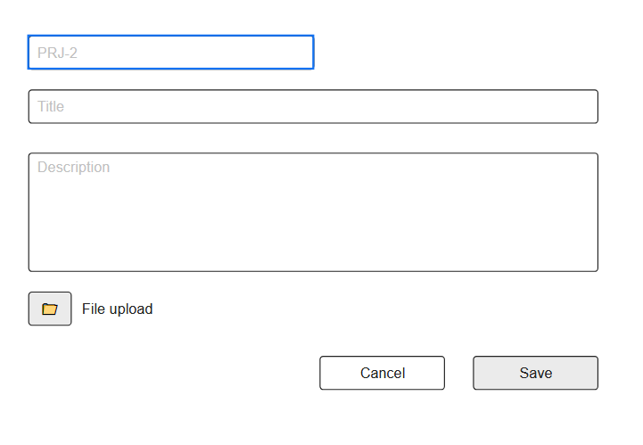

## Раздел Board

Пункт меню (раздел приложения): Board

Представляет собой типичную Kanban доску.

### UI

В строке действий справа разместить кнопку `Agent Recovery` непосредственно слева от `New task`. Использовать обычный стиль button для Recovery и primary для New task; на узких экранах разрешить перенос с выравниванием вправо, без горизонтального переполнения. Новых заголовков страницы не добавлять.

`Agent Recovery` получает список завершённых запусков с неподтверждённой остановкой через `GET /api/agent/recovery`. При отсутствии таких запусков показать Toast `No agent runs require recovery`. Для самой старой блокировки показать подтверждение, что агент этой задачи и его процессы уже остановлены на удалённом сервере; кнопка сама процессы не останавливает. При отказе ничего не менять. При подтверждении отправить `POST /api/agent/recovery` с `run_id`. Активные, неизвестные и уже подтверждённые запуски отклоняются с 409; отсутствие run_id — 422. Один клик восстанавливает один запуск; Toast сообщает число оставшихся блокировок либо разблокировку очереди. Задачи затем захватывает обычный consumer.

Во время получения списка и восстановления показывать общий Spinner с текстом `Recovering…`, блокировать кнопку и повторные клики. Успех/ошибки показывать через Toast, доступность кнопки восстанавливать в finally. Историю, статусы задач и другие блокировки сохранять. Кнопка и её JS подключаются только на Board. Контроллер — `controllers/agent.py`; отдельная CLI-команда отсутствует. Проверки: `tests/test_agent_recovery.py`, `tests/agent_recovery_ui.js`.

Колонки доски:
```
|  BACKLOG | OPEN | WAIT | IN PROGRESS | REVIEW | DONE |
|          |      |      |             |        |      |
```

> Колонки не настраиваемы, задаются логикой приложения. Задачи со статусом `ARCHIVE` в Board не отображаются и доступны в разделе Archive.

Структурный прототип блока задачи: 
- STATUS: показывает статус задач и внешний вид блока задачи
- COLUMN: соотвествие колонке доски, которые соотвествуют статусам (слеш означает множественное соотвествие)
- %TASK-ID% - идентификатор задачи (string), строка вида "PRJ-12"
- %TASK-TITLE% - название задачи, в блоке ограничено двумя строками через CSS `-webkit-line-clamp: 2`; многоточие и разбиение выполняет браузер, отдельного алгоритма сокращения по словам нет
- %STATUS% - виджет дополнительного статуса, отображаемый только для статуса `IN PROGRESS` (это не option, на прототипе сделана стилизация, желаемое отображение - кружок статуса + label статуса)

---

Структурный прототип формы создания/редактирования задачи: 

> Текущая форма имеет заголовок `New task` / `Edit <TASK-ID>`, подписи Task ID, Title, Description, Status, File upload и области ошибок под полями. ID занимает полную ширину и доступен для изменения только при создании. Загрузка — стандартный file input (по одному файлу на строку), кнопки `Add file` и `Remove`; иконка папки из схемы не используется. В модальном окне есть крестик закрытия. Поле Status скрыто при создании. Цвета и скругления — [main_ui.md](main_ui.md).

- При клике на блок существующей задачи открывается форма редактирования модальным окном
- При клике с ctrl (cmd) на блок существующей задачи форма открывается в новой вкладке браузера, при этом пункт меню "Board" должен быть активным, а кнопка Cancel отбражается только в случае открытия модального окна
- При нажатии на кнопку Cancel в модальном окне - изменения не сохраняются, окно закрывается
- Ошибки валидации отображаются рядом с полем в котором произошла ошибка
- При сохранении/создании отбражать виджет прелоадера
- Повторный submit или повторное действие во время активного Spinner не отправляет второй запрос. Пока запрос не завершён, закрытие модального окна крестиком или кликом по фону запрещено; после ошибки введённые значения сохраняются.
- Ошибки HTTP при загрузке, генерации ID, сохранении, архивировании и drag&drop обязательно отображаются через Toast; ошибки полей при сохранении дополнительно отображаются рядом с полями. Не оставлять необработанные отклонения Promise.
- Строка действий переносится на несколько строк при недостаточной ширине, сохраняя выравнивание вправо; кнопки не создают горизонтальное переполнение формы на экранах от 320px.
- Регрессионный браузерный тест: `node tests/board_errors.js` — ошибки HTTP, повторный submit, защита закрытия во время сохранения и ширины 320–1280px.
- Для существующей задачи в статусе `REVIEW` в форме редактирования отображаются кнопки `REOPEN` и `DONE`: `REOPEN` переводит задачу в `OPEN`, `DONE` — в `DONE`.
- Эти кнопки доступны как в модальном окне Board, так и на отдельной странице задачи; при создании и для всех остальных статусов они скрыты. Видимость определяется сохранённым статусом задачи, а не выбранным значением dropdown.
- Кнопки перехода расположены справа рядом с Save и выполняют только смену статуса, не сохраняя несохранённые изменения полей. Во время запроса показывается Spinner и блокируется форма; повторный запрос не отправляется. При ошибке показывается Toast, форма остаётся открытой с введёнными значениями.
- После успешного перехода доска обновляется и модальное окно закрывается; на отдельной странице форма обновляется с новым статусом без перехода на другую страницу.
- Вложения файлов - необязательное поле, множественное поле (можно добавить, можно удалить)
- При удалении существующего файла после нажатия Save - удалять файл

### Остановка из формы редактирования

- Для сохранённого статуса `IN PROGRESS` показывать `Stop` непосредственно слева от Save в модальном окне и на отдельной странице. Для создания и остальных статусов скрывать; несохранённый dropdown не влияет на видимость.
- Stop использует тот же PUT и валидацию, что выбор BACKLOG и Save: сохраняет поля и вложения, переводит задачу в BACKLOG и запускает существующую асинхронную отмену Init/ACP. Spinner блокирует форму и повторные запросы; ошибка сохраняет введённые значения и показывается через Toast.
- После успеха форма остаётся открытой в BACKLOG с полем комментария. Send comment сохраняет комментарий в истории, не меняя BACKLOG. Для продолжения пользователь явно переводит задачу в OPEN через dropdown и Save либо перенос карточки.
- При следующем захвате агент получает последний сохранённый комментарий через обычный механизм resume; новая сессия получает его вместе со стартовой инструкцией. Остановка и блокировка очереди до её подтверждения остаются прежними.
- Проверки: `tests/agent_cancel_ui.js`, `tests/test_agent_cancel.py`, `tests/test_agent_api.py`. Прогон 2026-09-23: 158 Python-тестов Board/API/отмены/ACP/Init успешно; после изоляции Config в fixture повторно прошли 15 тестов отмены. Playwright: `agent_cancel_ui.js`, `board_review_buttons.js`, `board_errors.js` успешно. Обе формы визуально сверены с прототипами на 1459px и проверены на 375px. ACP-процессы и потомки реальные локальные, SSH подменён; проверено ожидание 60 секунд при игнорировании отмены.

### Архивирование из формы редактирования

- Для существующей задачи с сохранённым статусом `WAIT` (включая ошибки Init/агента) или `DONE` показывать кнопку `To Archive` справа рядом с Save — в модальном окне и на отдельной странице задачи. При создании и в остальных статусах кнопка скрыта; несохранённый выбор dropdown не влияет на её видимость.
- Кнопка выполняет только переход в `ARCHIVE` через `PATCH /api/board/tasks/{task_id}/move`, без сохранения изменённых полей. Переход доступен также в dropdown WAIT.
- Во время запроса показывать Spinner и блокировать форму и повторные действия. При ошибке показывать Toast, сохраняя открытую форму и введённые значения.
- После успеха закрыть модальное окно и обновить Board; на отдельной странице перейти в Archive. Задача исчезает с Board и становится доступна в Archive.
- При обновлении сохранённого статуса через чат пересчитывать видимость кнопки; после Send comment и перехода в OPEN скрывать её.
- Проверки: `tests/board_archive_button.js` — видимость во всех статусах и архивирование WAIT/DONE; `tests/test_board.py` — допустимость архивирования и наличие задачи в Archive.

### Удаление BACKLOG

- У существующей задачи с сохранённым статусом `BACKLOG` показывать кнопку `Delete` в строке действий формы — в модальном окне и на отдельной странице. При создании и для других статусов Board кнопка скрыта; изменение dropdown без Save не влияет на видимость.
- Перед удалением запросить подтверждение. Несохранённые поля не сохранять. На время запроса включить Spinner, блокировку формы и защиту от повторного запроса.
- `DELETE /api/board/tasks/{task_id}` допускает только `BACKLOG`; отсутствующая задача или другой статус возвращают 404 без SSH.
- Попытаться подключиться по SSH и удалить папку задачи. Если подключение не установлено (сетевая ошибка, таймаут или ошибка SSH), продолжить локальное удаление. Если после подключения папка отсутствует (ENOENT), это также успех.
- После успешной очистки либо указанных допустимых исключений удалить запись задачи и записи вложений из БД, а локальные файлы вложений — из файловой системы; вернуть 204. При недоступном SSH удалённая папка может остаться на сервере.
- Ошибки конфигурации/безопасности пути и ошибки SFTP при удалении существующей папки не игнорировать: вернуть 502, сохранить локальные данные. Для Archive остаётся строгая политика из `archive.md`.
- После успеха обновить доску и закрыть модальное окно; с отдельной страницы перейти на Board. При ошибке показать Toast, сохранив форму и введённые значения.

### Обновление в реальном времени

- Открытая Board подписывается на `GET /api/board/events` через SSE (`EventSource`), без перезагрузки страницы.
- Сервер каждые 0,5 секунды читает согласованный снимок задач из общей SQLite, включая изменения отдельного процесса консьюмера. При изменении отправляет событие `board` с JSON `{ "tasks": [...] }`; при подключении всегда отправляет актуальный снимок. Это синхронизация текущего состояния, а не журнал каждого промежуточного перехода: состояния короче интервала проверки могут быть пропущены.
- При захвате задачи исполнителем карточка автоматически перемещается из `OPEN` в `IN PROGRESS`; обновляются счётчики, цвет и индикатор текущей фазы: `In progress` при подключении/подготовке, `Init` во время Bash и `Agent` при запуске/работе ACP. Завершение обновляет её до `REVIEW`, ошибка — до `WAIT` с признаком ошибки. Создание, изменение, архивирование и удаление в других клиентах также отражаются на Board.
- В нормальном соединении обновление ожидается в пределах 1 секунды после фиксации в БД, плюс время сети/отрисовки.
- Обновление карточек не сбрасывает введённые значения открытой формы. Во время drag&drop последний снимок откладывается до завершения перетаскивания. После локальных операций соединение обновляется для получения свежего снимка и исключения перезаписи актуального состояния запоздавшим HTTP-ответом.
- При разрыве показывается один Toast об автоматическом переподключении; `EventSource` восстанавливает соединение и получает актуальный снимок. Сервер отправляет heartbeat каждые 15 секунд без изменений; буферизация и кеширование SSE отключены. При уходе со страницы соединение закрывается, при возврате из back/forward cache восстанавливается.
- SSE подключается только на Board, не на Archive или отдельной странице редактирования. Макет и правила пользовательских переходов не меняются.

### Алгоритм работы доски

Допустимые переходы, которые может сделать пользователь через UI:
```
BACKLOG -> OPEN
IN PROGRESS -> BACKLOG
REVIEW -> OPEN
REVIEW -> BACKLOG
REVIEW -> DONE
BACKLOG -> ARCHIVE
WAIT -> ARCHIVE
DONE -> ARCHIVE
```

- `ARCHIVE` не является колонкой Board.
- Задачи в статусе `ARCHIVE` отображаются в разделе Archive постранично, по 20 задач.
- Переход в `ARCHIVE` допустим только из `BACKLOG`, `WAIT` и `DONE`.
- Из `ARCHIVE` нельзя выполнять пользовательские переходы в другие статусы.

Должен поддерживаться drag&drop по допустимым статусам Board. Перенос в `ARCHIVE` выполняется через доступное действие интерфейса, если оно предусмотрено на странице.

Сортировка задач: 
- отдельное системное поле порядка (int)
- при создании новой задачи - помещается в конец списка
- grag&dprop позволяет изменить порядок

**Хранение задач и схема данных**

Место хранения: В СУБД проекта

Создание, изменение и перемещение задачи выполняют чтение порядка/статуса, проверку перехода и запись в одной транзакции `BEGIN IMMEDIATE`. Конкурентное сохранение не должно перезаписывать захват задачи исполнителем на основе устаревшего статуса.

При откате транзакции новые файлы вложений очищаются. После успешного COMMIT ошибка удаления старого файла или чтения результата не должна удалять новые уже зафиксированные вложения. Ошибка очистки не означает откат сохранённых данных; оставшийся старый файл требует отдельной очистки.

Поля:

*%TASK_ID%*
- уникальный; подсказка ID берёт задачу с максимальным внутренним `id`, включая архив, и увеличивает числовой суффикс после последнего `-`. При отсутствии такой задачи или числового суффикса начинается с 1.
- при генерации подсказки конфликтующие номера пропускаются. Само создание с занятым ID возвращает 409 и ошибку поля; автоматического переименования при Save нет
- может быть перезаписан пользователем при создании задачи (при создании задачи заполнить на UI части при отображении формы создания задачи в соотвествие с алгоритмом выше)
- параметр префикса: `board.task_prefix`, fallback `TASK`. UI ограничивает ID 120 символами; сервер Board проверяет заполненность и уникальность, но не этот предел и не безопасность удалённого пути. Проверка безопасного имени выполняется отдельно перед SSH-подготовкой/удалением

*%TASK-TITLE%*
- Строка, обязательно к заполнению. Plain текст. Размер - не более 1000 символов.

*Текст задачи*
- Многострочное текстовое поле (максимальный размер 32000 символов)
- Обязательно к заполнению

*Статус задачи*
- При создании равен BACKLOG.
- Допустимые статусы Board: `BACKLOG`, `OPEN`, `WAIT`, `IN PROGRESS`, `REVIEW`, `DONE`.
- Статус `ARCHIVE` хранится в общей модели задачи, но не отображается колонкой Board.
- Напрямую не редактируется, переходы сделать аналогично тому, как это устроено в Jira: через dropdown в форме редактирования задачи (при создании не доступно для изменения).
- Переход в `ARCHIVE` разрешён только из `BACKLOG`, `WAIT` и `DONE`; переходы из `ARCHIVE` в другие статусы через UI запрещены.

*Дата создания*
- В формате дата-время.
- API возвращает дату в формате ГОД-МЕСЯЦ-ДЕНЬ ЧАС:МИНУТА (пример "2026-08-12 14:31"); в UI она отображается в списке Archive, но не на Board и не в форме задачи.

*Файлы*
Сами файлы хранить в файловой системе (папка [files](../data/files))

Временные multipart-файлы запроса закрываются при завершении создания/редактирования, включая ошибки валидации. Обработчики используют контекстный менеджер `request.form()`; регрессии — `tests/test_upload_resources.py`.

### Фазы запуска и ошибка Init

Индикатор `%STATUS%` показывать только для `IN PROGRESS`:

Кружок перед меткой `Init` заполнен жёлтым (`#f4e96f`), перед `Agent` — синим (`#4389e7`). Размер и контур кружка сохраняются; для `In progress` кружок остаётся без заливки. При смене фазы через SSE цвет обновляется вместе с меткой без перезагрузки страницы.

| Этап | Метка |
| --- | --- |
| Подключение и подготовка контекста до запуска скрипта | `In progress` |
| Выполнение скрипта | `Init` |
| Скрипт успешно завершён, идёт запуск/инициализация агента | `Agent` |
| ACP инициализирован, отправлен `session/prompt`, агент работает | `Agent` |

Если Init отключён или уже успешно выполнен, метку `Init` не показывать; переключаться на `Agent` при переходе к запуску агента. Таким образом, `Agent` обозначает также подготовку агентской сессии, а не только уже отправленный промпт.

Фазу хранить в БД и передавать в SSE-снимке по правилам обновления в реальном времени выше. При выходе из `IN PROGRESS` индикатор скрывать. Действующее правило снимков сохраняется: короткий Init может не попасть в интервал наблюдения 500 мс.

Ошибка выполнения, включая Init, переводит карточку в `WAIT`; отдельного статуса ERROR нет. Красная полоса определяется `is_error` независимо от статуса. Send comment переводит задачу в OPEN без сброса этого флага, поэтому карточка остаётся красной до захвата исполнителем, который сбрасывает ошибку. В эталоне `board-task-block.png` исправлена подпись колонки красной карточки на WAIT. Ручной переход IN PROGRESS → BACKLOG через Stop, Save любой формы или перенос карточки отменяет текущую фазу: Init останавливается, ACP получает `session/cancel` с ожиданием до 60 секунд, затем останавливается удалённая группа процессов и закрывается SSH. Карточка сразу переходит в BACKLOG; остановка выполняется асинхронно, удерживая очередь до завершения. Поздний результат не возвращает карточку в WAIT/REVIEW и не меняет новый запуск. Неподтверждённая остановка блокирует новые запуски и отображается системным сообщением в чате. Повтор после ошибки — через Send comment из WAIT. Правила выполнения и отмены — [agent.md](agent.md).

### Детали текущего отображения

Доска содержит шесть колонок со счётчиками. При недостаточной ширине прокручивается сама доска; колонки не перестраиваются в вертикальный список. Карточка белая, с тонким тёмным контуром, скруглением 15px и верхней полосой высотой 11px: BACKLOG/OPEN — `#aaa`, IN PROGRESS — `#4389e7`, REVIEW/DONE — `#83c966`, WAIT — `#f4e96f`, `is_error` — `#f15b5b`. Минимальная высота карточки 128px.

Дата создания хранится и возвращается API в локальном времени сервера; на карточке Board и в форме задачи она не выводится. В Archive дата отображается в строке списка. Title и Description при сохранении обрезаются по краям.

Новые задачи добавляются в конец BACKLOG; Save со сменой статуса — в конец целевой колонки. Перетаскивание задаёт позицию и пересчитывает порядок. Кнопки REOPEN/DONE/To Archive передают `position: 0`. Send comment из WAIT/REVIEW меняет статус на OPEN, сохраняя прежний `sort_order`; в BACKLOG сохраняет статус и порядок.

Модальная форма без чата ограничена 680px, отдельная страница — 760px. С чатом доступная ширина расширяется до 1360px; до 700px чат переносится под поля. Список существующих вложений показывает имя и Remove, без ссылки скачивания. Серверный endpoint скачивания описан реализацией `controllers/board.py`.

Архивирование через dropdown и Save отличается от `To Archive`: модальная форма закрывается, но на отдельной странице общий Save не выполняет переход в Archive и не переводит уже открытую форму в режим просмотра. После перезагрузки этой страницы применяется архивный режим из [archive.md](archive.md).

### Сохранённые требования при повторном запуске

После Save изменения описания и состава вложений используются при следующем захвате `OPEN → IN PROGRESS`: удалённый `requirements-<TASK-ID>` синхронизируется до Init/ACP, удалённые вложения удаляются и на хосте. Это действует после REOPEN из REVIEW и повтора из WAIT. REOPEN сам не сохраняет поля формы. Синхронизация и ошибки описаны в [agent.md](agent.md#синхронизация-при-каждом-запуске).
