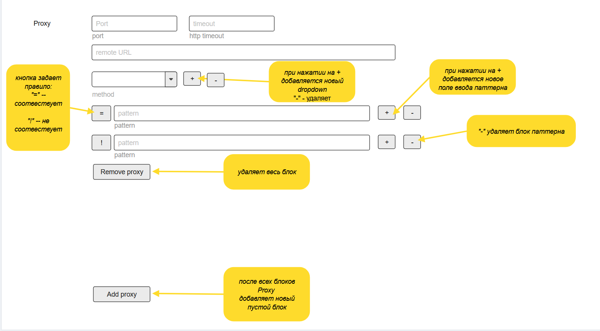

## HTTP proxy

### Реализация и регрессионные проверки

- Конфигурация и GET-проверки: `settings/http_proxy.py`; явная интеграция кастомной секции: `settings/settings.py`.
- Потоковый транспорт и независимые listeners: `http_proxy.py`; lifecycle: `main.py`; передача фактических host/port: `start.py`.
- Кастомная форма: `templates/http_proxy.html`, `static/js/http-proxy.js`, `static/css/http-proxy.css`. Сборка JS и модули `import` не требуются.
- Python-регрессии: `tests/test_http_proxy.py`, `tests/test_http_proxy_settings.py`, `tests/test_http_proxy_api.py`, `tests/test_http_proxy_tls.py`. Проверяются исходный URI, методы и тела, заголовки, gzip, cookie isolation, фильтры, 502/504, SSE, отключение клиента, TLS с самоподписанным сертификатом и несовпадающим именем, сохранение и lifecycle.
- Горячее применение: `tests/test_http_proxy_live.py` проверяет успешный Save с реальными HTTP-запросами и открытым SSE, неизменность listeners/пула/отложенных параметров, ошибки Save, сопоставление по порту и параллельные сохранения.
- Браузерные регрессии: `node tests/http_proxy_ui.js` с окружением Playwright; проверяются элементы управления, сохранённые значения, пустой список, spinner, Toast для горячего применения и отложенных изменений, отсутствие горизонтального переполнения на 320–1440px. `HTTP_PROXY_SCREENSHOT` задаёт необязательный путь временного снимка для визуальной сверки; после проверки снимок удаляется.

### Контекст и жизненный цикл

Параллельно с приложением запускаются HTTP reverse proxy серверы. Каждый блок Proxy задаёт отдельный сервер по адресу `http://{адрес приложения}:{port}/` с фиксированным upstream из `remote URL`.

- Прокси слушают тот же bind-адрес, что и основное приложение, в том числе `0.0.0.0`/`::`.
- Авторизации на прокси нет. Доступ ограничивается средствами сети; сетевая доступность без авторизации явно согласована. Ограничения method/pattern не являются авторизацией.
- Серверы запускаются из сохранённой конфигурации при старте приложения и останавливаются вместе с ним.
- Save сохраняет валидную конфигурацию и сразу применяет `methods` и `patterns` к работающим прокси без перезапуска приложения или listeners. Добавление/удаление прокси, изменение `port`, `remote_url` и `timeout` по-прежнему применяются после перезапуска.
- Работающий прокси сопоставляется с сохранённым блоком по `port`, а не по позиции в массиве. При неизменном порте правила обновляются даже при отложенном изменении remote URL/timeout; до перезапуска они действуют на текущий upstream с текущим timeout. При изменении порта старый listener и его правила остаются прежними до перезапуска. Удалённые блоки также продолжают работать с прежними правилами; добавленные и не запустившиеся прокси не запускаются по Save.
- Методы и скомпилированные паттерны каждого прокси заменяются единым неизменяемым снимком только после успешной валидации, GET-проверок и атомарной записи файла. При любой ошибке Save файл и действующие правила сохраняются. Параллельные Save этой секции сериализованы: итоговые правила соответствуют последнему успешно записанному файлу.
- Каждый новый запрос использует один снимок правил. Уже разрешённые запросы, загрузки и SSE не перепроверяются и не прерываются при изменении правил. Прямое редактирование JSON без Save не запускает горячее применение.
- Ответ Save содержит `restart_required`: `true`, если состав/порты работающих прокси или их remote URL/timeout отличаются от сохранённых; иначе `false`. UI через Toast подтверждает применение методов/паттернов без перезапуска и отдельно предупреждает о требующем перезапуска остатке изменений. Ожидающие перезапуска изменения учитываются и при последующих Save.
- Ошибка запуска одного прокси, в том числе занятый порт, не останавливает приложение и остальные прокси. Ошибка должна быть видна пользователю с указанием проблемного прокси.

Пример:

- Прокси: `http://127.0.0.1:8001/`.
- `remote URL`: `https://foo.example.com/`.
- Запрос клиента: `GET http://127.0.0.1:8001/object?id=42`.
- Запрос к upstream: `GET https://foo.example.com/object?id=42`.

Прокси передаёт метод, исходные path и query, тело и заголовки по правилам ниже. Затем возвращает клиенту статус, тело и заголовки ответа upstream.

### UI страницы Settings

Эталон блока Proxy и элементов управления:



- Последней вкладкой Settings добавляется `HTTP proxy`.
- Разметка и логика вкладки кастомные, не задаются метаинформацией полей. Общие виджеты и оформление Settings сохраняются; дополнительных заголовков и подзаголовков страницы нет.
- Каждый блок Proxy содержит port и timeout в одной строке, remote URL ниже, строки method, строки pattern и кнопку `Remove proxy`.
- По умолчанию блоков Proxy нет; отображаются `Add proxy` и стандартная кнопка Save.
- `Add proxy` располагается после всех блоков и добавляет новый блок с незаполненными port и remote URL, timeout `30`, одной строкой method со значением `GET` и одной пустой строкой pattern с оператором `=`. Каждый дополнительный dropdown method также создаётся со значением `GET`, каждая дополнительная строка pattern — с пустым полем и оператором `=`.
- `Remove proxy` удаляет весь соответствующий блок из редактируемой конфигурации, включая последний блок.
- `+` у method добавляет dropdown, `-` удаляет соответствующий dropdown. Удалять единственный dropdown нельзя; его кнопка `-` отключена. Для отсутствия ограничений выбирается `ALL`.
- `+` у pattern добавляет строку pattern, `-` удаляет соответствующую строку вместе с оператором. Удалять единственную строку нельзя; её кнопка `-` отключена. Для отсутствия ограничений поле оставляют пустым.
- Кнопка оператора pattern циклически переключается между `=` и `!`. Она не является кнопкой удаления.
- Желтые пояснения и стрелки макета описывают поведение и не являются элементами интерфейса.
- Save валидирует всю секцию, проверяет доступность каждого remote URL через GET по правилам ниже и только после успешных проверок сохраняет JSON в `settings/user/http_proxy.json`. При ошибке прежний файл не перезаписывается, пользователю отображается ошибка соответствующего блока.
- На время Save используется стандартный spinner с блокировкой кнопки и связанных полей формы до завершения операции, включая ошибку; результат отображается через Toast.
- Можно удалить все блоки и сохранить пустой список прокси; в этом случае сетевые проверки не выполняются. После перезапуска ни один прокси-сервер не запускается.

### Поля и валидация

**port**

- Обязательное целое число строго больше `8000`; допустимый диапазон — `8001–65535`.
- Порты разных блоков Proxy не повторяются.
- Запретить совпадение с фактическим портом основного web-сервера. В штатном запуске через `start.py` этот порт известен из `--port` и должен быть доступен валидатору; нельзя проверять только значение по умолчанию `8000`.
- Если при другом способе запуска порт основного приложения недоступен, конфликт обнаруживается при попытке запуска прокси и отображается как ошибка запуска.

**timeout**

- Обязательное положительное целое число секунд, по умолчанию `30`; пустое поле недопустимо.
- Ограничивает установление соединения и ожидание очередной порции данных, но не общую продолжительность ответа.
- Для SSE применяется тот же таймаут бездействия.

Для целочисленных полей не допускаются JSON boolean, дробные числа и контейнеры; строковое представление целого числа допустимо, сохраняется число, без округления.

**remote URL**

- Адрес upstream содержит схему `http` или `https`, host и необязательный port. Путь допускается только пустой или `/`.
- Префикс пути не поддерживается: `/object?id=42` направляется на `/object?id=42` заданного upstream.
- В составе remote URL не предусмотрены userinfo, query и fragment: адрес состоит только из перечисленных выше частей.
- При HTTPS-запросах к upstream отключить проверку цепочки сертификатов и имени хоста, в том числе принимать самоподписанные сертификаты. Это относится и к проверке при Save, и к проксируемым запросам; настройки TLS остальных сервисов приложения не меняются.
- Риск явно принят: соединение шифруется, но подлинность upstream не проверяется, что допускает перехват трафика, включая передаваемые Cookie и Authorization.

**Проверка доступности при Save**

- После проверки формата полей выполнить серверный GET непосредственно на remote URL каждого блока из сохраняемой конфигурации, не через локальный прокси.
- Проверочный GET не ограничивается выбранными method и pattern: они применяются к клиентским запросам, а не к проверке настроек.
- Использовать timeout соответствующего блока и согласованную выше политику TLS; автоматически не следовать редиректам. Не передавать Cookie и Authorization запроса сохранения настроек на upstream.
- Проверяется сетевая доступность, а не успешность прикладной операции: получение конечного HTTP-статуса, включая `3xx/4xx/5xx`, означает, что remote URL доступен. Не загружать всё тело проверочного ответа; после получения статуса и заголовков закрыть ответ, чтобы потоковый endpoint не задерживал Save.
- Ошибка DNS, соединения, TLS или таймаут означают неуспешную проверку; секция не сохраняется. Ошибка отображается без раскрытия внутренних деталей.

**method и pattern**

- Значения method принадлежат поддерживаемому набору ниже либо равны `ALL`. Пустого значения dropdown нет; значение по умолчанию — `GET`.
- Непустое поле pattern должно содержать валидное регулярное выражение Python.
- Полностью пустое поле pattern не является ограничением. Пробелы в непустом regexp не обрезаются.
- Допустимые операторы pattern — `=` и `!`.

### Ограничения method

- Поддерживаются `GET`, `HEAD`, `POST`, `PUT`, `PATCH`, `DELETE`, `OPTIONS`. Dropdown содержит этот набор и значение `ALL`.
- `ALL` означает все поддерживаемые методы, а не любые произвольные HTTP-методы. Если хотя бы в одном dropdown выбрано `ALL`, остальные выбранные методы не сужают разрешённый набор.
- В UI всегда остаётся хотя бы один dropdown. Отсутствие ограничений задаётся выбором `ALL`; пустой массив в сохранённой конфигурации также означает отсутствие ограничений и отображается как одна строка `ALL`.
- Несколько dropdown образуют объединение разрешённых методов (ИЛИ).
- Любой метод вне поддерживаемого набора или вне выбранного разрешённого набора получает `403` с сообщением `Access denied by proxy server`.
- `CONNECT`, `TRACE` и нестандартные методы не поддерживаются даже при `ALL`; туннелирование не реализуется.
- Тело запроса передаётся для любого поддерживаемого метода, если клиент его отправил, а не только для POST/PUT.

### Ограничения pattern

- Каждый непустой pattern проверяется через `re.match` по исходной строке `path?query` без URL-декодирования и нормализации. Если query отсутствует, проверяется path без добавления `?`.
- Upstream получает те же исходные path и query, без перестроения параметров.
- При `=` правило выполнено, если `re.match` нашёл совпадение; при `!` — если совпадения нет.
- URI должен удовлетворять всем непустым правилам (И).
- При отсутствии непустых pattern разрешены любые URI в рамках настроенного upstream и ограничений method.
- При нарушении хотя бы одного правила запрос не отправляется upstream; клиент получает `403` с сообщением `Access denied by proxy server`.
- Для HEAD сохраняется семантика HTTP: ответ имеет тот же статус отказа, но тело не передаётся.

Примеры:

| Правило | Разрешено | Отклонено |
| --- | --- | --- |
| `[=] ^/documents/$` | `/documents/` | `/documents?id=1`, `/documents/?id=1` |
| `[=] ^/documents/[\d]+$` | `/documents/12` | `/documents/12?id=1` |
| `[=] ^/documents/` | `/documents/`, `/documents/document?id=12` | `/other/` |

### Передача запросов, ответов и заголовков

- Передавать статус upstream, тело и end-to-end заголовки. Повторяющиеся заголовки сохраняются, в частности отдельные `Set-Cookie` не объединяются в одну строку.
- Удалять hop-by-hop заголовки в обоих направлениях, включая заголовки, перечисленные в `Connection`. Транспорт формирует framing-заголовки с учётом фактической передачи тела.
- Исходящий `Host` формировать из remote URL.
- Не распаковывать и не перекодировать тело незаметно для клиента; тело, Content-Encoding и данные о длине должны оставаться согласованными.
- Клиентские `Cookie` и `Authorization` передавать upstream. Общий cookie jar между клиентами не использовать.
- `Location` и атрибуты `Domain`/`Path` у `Set-Cookie` передавать без изменений, не переписывать под адрес прокси.
- Не следовать редиректам автоматически. Ответы `301/302/303/307/308` возвращать клиенту с исходным статусом и `Location`.
- HTTP-ошибки upstream, включая `4xx/5xx`, передавать без подмены.

### Потоковая передача и ошибки транспорта

- Обычные HTTP request/response передаются потоково, без накопления всего тела в памяти; поддерживается SSE.
- WebSocket, Upgrade и CONNECT-туннели не реализуются.
- При отключении клиента соответствующий upstream-запрос закрывается.
- При таймауте до начала ответа клиенту возвращается `504 Gateway Timeout`.
- При ошибках DNS, соединения или TLS до начала ответа клиенту возвращается `502 Bad Gateway` без раскрытия внутренних деталей.
- Если ответ клиенту уже начат, сетевая ошибка или таймаут прерывают поток: заменить уже отправленный статус невозможно.

### Хранение и интеграция с сервисом настроек

Для этой секции используется отдельный кастомный обработчик. Это исключение из описанного в `specs/settings.md` механизма метаданных и плоских пользовательских настроек.

- Идентификатор секции — `http_proxy`, название вкладки — `HTTP proxy`.
- Общий сервис настроек явно направляет операции секции `http_proxy` в её кастомный обработчик до стандартной обработки полей. Метаданные `groups/fields`, общая нормализация строк и плоская валидация к ней не применяются.
- Вкладка регистрируется отдельно и выводится последней, без файла описания полей в `settings/ui`.
- Чтение, валидация, значения по умолчанию и сохранение вложенной конфигурации находятся в отдельном модуле; обработчики остальных секций не меняются.
- Файл конфигурации — `settings/user/http_proxy.json`, корень — объект с массивом `proxies`.
- `Config.get('http_proxy.proxies')` возвращает массив через кастомный обработчик. Для остальных секций поведение `Config.get` сохраняется.
- Отсутствующий файл означает `{"proxies": []}`.
- Каждый прокси содержит `port`, `timeout`, `remote_url`, `methods` (массив строк) и `patterns` (массив объектов с ключами `operator` и `pattern`).
- При выборе `ALL` сохранять `methods: ["ALL"]`, независимо от других выбранных dropdown. При чтении `["ALL"]` или пустого массива показывать одну строку `ALL`, не подставлять GET.
- Пустые поля pattern не сохраняются как ограничения; непустые сохраняются без обрезания пробелов. Пустой массив `patterns` при открытии формы отображается одной пустой строкой с оператором `=`.
- Вся секция проходит серверную валидацию и GET-проверки доступности до записи. Save сохраняет конфигурацию целиком только после успешных проверок, затем применяет методы и паттерны работающих прокси. Остальные настройки требуют перезапуска по правилам жизненного цикла выше.

Пример сохранённой конфигурации:

```json
{
  "proxies": [
    {
      "port": 8001,
      "timeout": 30,
      "remote_url": "https://foo.example.com/",
      "methods": ["GET", "POST"],
      "patterns": [
        {"operator": "=", "pattern": "^/documents/"},
        {"operator": "!", "pattern": "^/documents/private/"}
      ]
    }
  ]
}
```