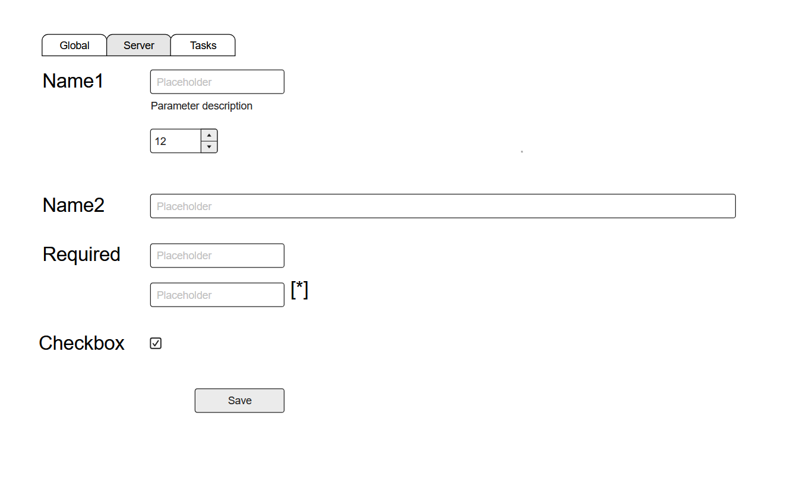

## Раздел Settings (конфигурация)

### UI

Дизайн: 

Две колонки:
- колонка названий групп полей конфигурации
- колонка полей

Вкладки сверху: переключают разделы конфигурации

Name1, Name2, Required, Checkbox - названия группы полей конфигурации.

Каждая группа может содержать несколько полей (может содержать одно, как Name2).

Типы полей:
- string (однострочный input)
- password (однострочный input типа password)
- integer (однострочный input, только целые числа)
- text (многострочный резиновый по высоте textarea, размер 50% своей колонки)
- checkbox

Дополнительные параметры для полей:
- для типа string: может иметь подтип small (по-умолчанию, короткое поле), может иметь подтип big (размер на 90% своей колонки)
- для всех типов, кроме checkbox: подтип required - поле обязательно для заполнения, в UI необходимо пометить символом `*`
- Красная звёздочка обязательности располагается снаружи справа от поля с отступом 8px, на уровне первой строки. Положение привязано к фактической ширине поля, включая textarea и подтип big; звёздочка не перекрывает текст, числовые стрелки и область изменения размера. На мобильных экранах под неё резервируется место без горизонтального переполнения.

Кнопка Save валидирует и сохраняет значения.

### Проверка обязательных полей

Сетку полей Settings ограничивать селектором `.settings-form`: общий класс `.field-control` также используется формой задачи и не должен получать двухколоночную раскладку настроек.

Регрессионный браузерный тест: `node tests/settings_required.js` (Playwright и Python3 с Jinja2). Проверяет шесть вариантов полей на ширинах 320–1440px, расположение звёздочек вне полей и сохранение required-валидации. Дополнительно проверяет изоляцию формы создания/редактирования задачи: поля сохраняют полную ширину, подписи находятся сверху, ошибки снизу, видимость статуса не переопределяется стилями Settings.

### Алгоритм работы

**Управление отображением страницы**

Каждая стандартная вкладка ("секция" конфигурации) управляется метаинформацией полей через файлы из папки [ui](../settings/ui). Пример файла: [remote_server.json](../settings/ui/remote_server.json)

Исключение — последняя вкладка `HTTP proxy`: она регистрируется отдельно, не имеет файла метаданных и использует вложенную конфигурацию и кастомный обработчик `settings/http_proxy.py`. Общий сервис направляет чтение, валидацию и сохранение этой секции в обработчик до обработки стандартных полей. После успешного Save методы и паттерны работающих прокси применяются сразу; добавление/удаление и изменение port, remote URL, timeout требуют перезапуска. Toast различает эти результаты. Подробности — [http-proxy.md](http-proxy.md).

Название вкладки - поле `title`

Группы полей конфигурации в массиве `groups`. `groups[].title` - Название конкретной групппы (левая колонка UI).

`fields` - поля конфигурации:
- `id` - идентификатор поля внутри секции конфигурации
- `type` - тип поля
- `required` - признак обязательности
- `description` - описание поля
- `sub_type` - подтип поля
- `title` - помещается в placeholder для полей типа string, password, integer, text; для поля checkbox выводится слева от UI элемента checkbox
- `default` - значение по-умолчанию

*Сохранение параметров конфигурации*

При сохранении конкретный раздел конфигурации после успешной валидации сохраняется в файл, соответствующий имени файла из [ui](../settings/ui) в папку [user](../settings/user) (с перезаписью).

Формат файла в папке [user](../settings/user) JSON, с ключами, соотвествующими `groups[].fields[].id`:
```json
{
  "field_name1": "text value",
  "field_name2": 12,
  "field_checkbox": true
}
```

При открытии раздела Settings читаются все файлы из папки [settings](../settings), формируются названия вкладок; 
первая по порядку вкладка открывается и у нее заполняются все элементы со значениями из соотвествующего файла в папке [user](../settings/user);
если файла в [user](../settings/user) не существует - значения заполняют значениями по-умолчанию (`default`) из файла метаинформации.

**Валидация**

- Для type == integer проверяем что введено корректно int значение больше или равно 0. JSON boolean, дробные числа и контейнеры отклоняются, а не преобразуются через округление; строка целого числа допустима.
- Если поле required - проверяем что оно не пусто, а для type == integer что значение строго больше 0

**Дополнительная валидация для разделов**

*Remote server*

В файле [remote_server.py](../settings/validation/remote_server.py) добавь логику:
- Должно быть обязательно заполнено одно из полей: `password`, `ssh_key`
- Валидация подключения SSH: выполнить подключение по переданным реквизитам и адресу сервера с запуском команды из параметра id: `test_shell`
- Поддерживаются hostname/IP без порта (22), `host:port`, bare IPv6 и `[IPv6]:port`; диапазон порта 1–65535.
- Использовать известные host keys и RejectPolicy; при заданном SSH-ключе не использовать пароль и не подбирать ключи из окружения.
- Команда проверки ограничена 10 секундами, stdout и stderr вычитываются без накопления; при таймауте канал и соединение закрываются. Ошибки возвращают безопасное сообщение без stderr, пароля и содержимого ключей.
- Регрессии конфигурации и SSH проверяются в `tests/test_settings_regressions.py` без реальных подключений.

**Работа с конфигурацией**

Нужен сервисный слой, который позволит использовать сохраненные значения конфигурации.

Пример вызова:
```python
Config.get('config_section.parameter_name1')
```

Если 'config_section.parameter_name1' не сохранен в соотвествующем [user](../settings/user), то:
1. Если в описании параметра (в соотвествующем [ui](../settings/ui)) есть default значение - вернуть его
2. Если default значения нет - вернуть None