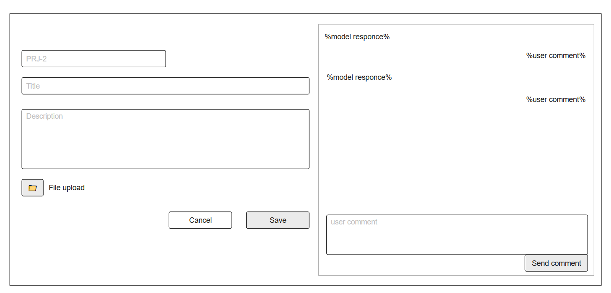

## Состояние и комментарии к задаче

См. прототип дизайна 

Виджет доступен для существующей задачи любого статуса, если есть сообщения; в BACKLOG/WAIT/REVIEW он виден и с пустой историей, поскольку содержит форму комментария. При создании задачи виджет скрыт. На ширине более 700px расположен справа от полей, на меньшей ширине — под ними. Схема PNG показывает расположение, а текущие сообщения имеют фон, дату и кнопку копирования.

Область сообщений автоматически прокручивается к последнему сообщению только при получении нового статуса агента или изменении его текста/даты-времени, независимо от текущей позиции прокрутки. Первичная загрузка истории, опрос без изменений, комментарии пользователя и смена состояния задачи сами по себе не запускают автопрокрутку.

Сообщение "%model responce%" - это последнее актуальное сообщение от удаленного агента. В случае если задача IN PROGRESS - тут необходимо отбражать в реальном времении
последний ответ агента (пример формирования ответа см. в [test_remote_agent.py](../test_remote_agent.py)). В пределах одного запуска (`run_id`) предыдущий ответ агента заменяется новым, а не добавляется в этот виджет. При отправке комментария и перезапуске задачи последний статус каждого предыдущего запуска сохраняется вместе с его датой-временем. Новый запуск формирует отдельный статус; история отображается в порядке создания сообщений, включая комментарии пользователя. Для каждого сообщения отображается дата-время его последнего обновления в формате `ГГГГ-ММ-ДД ЧЧ:ММ`.


Сообщение "%user comment%" - комментарий пользователя из поля ввода "user comment". Поле ввода комментария отображается только в статусах:
- REVIEW
- WAIT
- BACKLOG

Комментарий пользователя также содержит дату-время отправки в формате `ГГГГ-ММ-ДД ЧЧ:ММ`.
При нажатии "Send comment" комментарий сохраняется и обновляется история. Из WAIT/REVIEW задача переводится в OPEN. В BACKLOG статус не меняется: пользователь отдельно переводит задачу в OPEN через Save или перенос карточки. При следующем захвате последний сохранённый комментарий передаётся агенту; само заполнение поля без Send comment ничего не отправляет.
Алгоритм повторного запуска определяется наличием сохранённой агентской сессии, а не только комментария:
- При наличии `sessionId` выполнить ACP `session/load`; пользовательский комментарий передать в `session/prompt`. `${PROMPT}` в shell необязателен и заменяется одним экранированным аргументом только при наличии; `continue_session_arg` добавляется только при существующей сессии, если настроен.
- Если `session/load` явно сообщает об отсутствующей сессии, один раз создать новую в том же запуске и передать стартовую инструкцию прочитать требования вместе с текущим комментарием. Сохранить новый `sessionId`; успешное восстановление не переводит задачу в WAIT и не добавляет ошибку в чат. История предыдущих запусков сохраняется. Подробные условия и обработка прочих ошибок — [agent.md](agent.md#первый-запуск-и-повтор).
- После ошибки Init агентской сессии ещё нет: повторить неуспешный Init по новым настройкам, затем выполнить `session/new` без `continue_session_arg`. Промпт объединяет английскую инструкцию прочитать `requirements-${TASK_ID}/TASK.md` и комментарий.
- Переиспользовать безопасный учтённый каталог, не перезаписывая `TASK.md` и вложения; неизвестный каталог первого запуска отклонять. Полные правила — [запуск задачи](agent.md).

Последовательные `agent_message_chunk` накапливаются в текущий ответ; перед callback текст очищается от известных секретов и их неполного суффикса. `agent_thought_chunk`, `user_message_chunk`, `tool_call` и `tool_call_update` сбрасывают буфер текущего ответа, поэтому следующая последовательность заменяет предыдущий ответ этого run_id. Thoughts/stderr в callback не передаются. Полный журнал БД санитизируется отдельно; сырые файловые логи ACP не санитизируются — см. [agent.md](agent.md#диагностика-и-сырые-логи).

Обновление Board выполняется SSE polling-снимками каждые 500ms; task chat остаётся отдельным endpoint GET/POST `/api/board/tasks/{task_id}/chat`. Комментарий принимается атомарно для `BACKLOG`/`WAIT`/`REVIEW`; BACKLOG сохраняется, WAIT/REVIEW переводятся в OPEN. Недопустимый статус возвращает 409, некорректный комментарий — 422. Ошибка агента переводит задачу в `WAIT` с признаком ошибки.

### Ошибки и вывод Init

- При ошибке Init добавлять отдельное системное сообщение `Init script error` с `run_id` и датой-временем в формате чата `ГГГГ-ММ-ДД ЧЧ:ММ`. Сохранять его при последующих попытках, не заменять ответом агента и не дублировать при опросе.
- Диагностику выбирать в порядке: непустой stderr → непустой stdout → `Init script error: <exit_code>`, если оба потока пусты.
- Если код выхода недоступен, указывать фактическую причину: таймаут, разрыв SSH или невозможность запуска; не подставлять выдуманный код.
- Если процесс завершился с кодом `0` до PID-handshake, показывать `Init script error: process exited before startup handshake`; это ошибка протокола запуска, а не ошибка скрипта с нулевым кодом.
- Читать stdout и stderr параллельно, отдельно от ACP. Сохраняемый объём каждого потока ограничить 64 КиБ, при превышении явно отмечать усечение. Это заменяет исходное требование показывать «весь stdout».
- Перед сохранением и показом удалять известные секреты, включая секреты на границах порций данных и границе усечения. Вывод отображать как текст, не HTML.

Системное сообщение имеет роль `system`; отображение использует `textContent` с сохранением переносов строк, без интерпретации Markdown. Успешный Init не добавляет сообщения в чат: его безопасный диагностический вывод остаётся только в журнале запуска.

### Отмена агента

После ручного перевода IN PROGRESS → BACKLOG и завершения остановки сохранять системное сообщение `Remote agent cancelled.` с `run_id` и датой. При неподтверждённой остановке добавлять `Remote stop unconfirmed; retry blocked pending verification.`; очередь блокируется до проверки оператором. Сообщения отображаются существующим текстовым представлением роли `system` и сохраняются после перезагрузки. Поздние `agent_message_chunk` отменённого запуска не заменяют историю ответа. Статус остаётся BACKLOG; поле комментария доступно сразу после перехода, включая время асинхронной остановки. Отправка комментария не запускает агента и не снимает блокировку очереди. Предел ожидания ACP — 60 секунд; полный порядок — [agent.md](agent.md#ручная-отмена-acp-in-progress--backlog).

### Конфликт каталога требований

Если при первой подготовке уже существует `requirements-${TASK_ID}`, задача переходит в `WAIT` с признаком ошибки. В чат сохраняется `Task directory requirements-${TASK_ID} already exists.` с фактическим ID, датой и run_id; сообщение остаётся после перезагрузки и последующих попыток. Init и ACP не запускаются. Подготовленный и учтённый контекст при повторе из `WAIT` переиспользуется без перезаписи; неизвестный или частично подготовленный контекст не переиспользуется.

Пример сообщения для задачи `PRJ-12`:

```text
Task directory requirements-PRJ-12 already exists.
```

Это ошибка подготовки контекста, поэтому к тексту не добавляется префикс `Init script error`. В БД она сохраняется с ролью `agent` и отображается общим Markdown-рендерером; специального plain-text режима для этого сообщения нет. После `Send comment` история ошибки сохраняется; сам комментарий не разрешает перезапись конфликтующего каталога. Полные условия повтора — [agent.md](agent.md#первый-запуск-и-повтор).

### Рендеринг и доставка сообщений

Чат получает GET `/api/board/tasks/{task_id}/chat` при открытии и затем через 500 мс после завершения предыдущего запроса; это отдельный polling, не SSE. Во время Spinner новые данные откладываются. Закрытие формы отменяет текущий запрос. Поле комментария ограничено 32000 символами, пробелы по краям удаляются; Send comment использует Spinner и блокирует форму.

`agent` и `user` отображаются через локальный `marked.umd.js` с `breaks: true`, результат вставляется в `innerHTML`. Отдельного HTML-санитайзера нет, исходный HTML в этих сообщениях может попасть в DOM. Только роль `system` выводится через `textContent` и `white-space: pre-wrap`. Кнопка `Copy message as Markdown` у каждого сообщения копирует исходный текст через Clipboard API и сообщает успех/ошибку в Toast.

Ошибка Init, явная отмена и неподтверждённая остановка создают сообщение `system`. Обычная ошибка подготовки/SSH/ACP записывается с ролью `agent`; если ответ этого run_id уже существует, ошибка добавляется к нему через пустую строку. Поэтому диагностика обычного сбоя также отображается Markdown-рендерером. Сообщения агента и system расположены слева на сером фоне, пользователя — справа на голубом.
